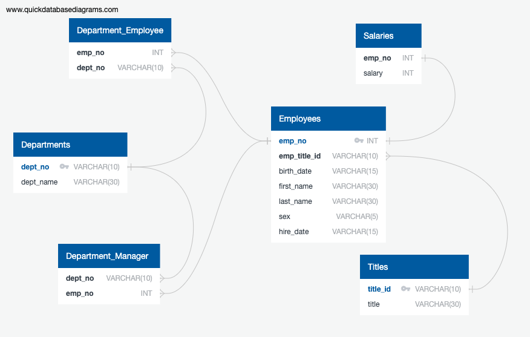
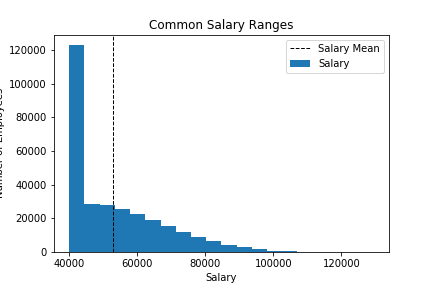
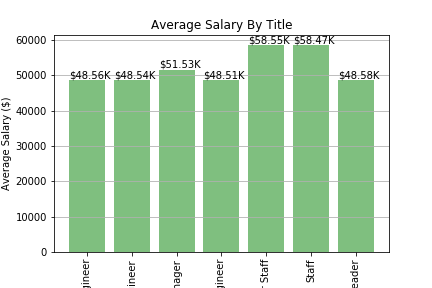

# SQL_Challenge

## Background

It is a beautiful spring day, and it is two weeks since you have been hired as a new data engineer at Pewlett Hackard. Your first major task is a research project on employees of the corporation from the 1980s and 1990s. All that remain of the database of employees from that period are six CSV files.

## Data

* departments.csv
* dept_emp.csv
* dept_manager.csv
* employees.csv
* salaries.csv
* titles.csv

### ERD

To sketch an ERD from my csv files, I used [http://www.quickdatabasediagrams.com](http://www.quickdatabasediagrams.com)

### Analysis of SQL Tables

* Using postgres, I was able to pull my csv file into a database and set primary keys and foreign keys.

* I was then able to use my database to find the following information
    1. List the following details of each employee: employee number, last name, first name, sex, and salary.

    2. List first name, last name, and hire date for employees who were hired in 1986.

    3. List the manager of each department with the following information: department number, department name, the manager's employee number, last name, first name.

    4. List the department of each employee with the following information: employee number, last name, first name, and department name.

    5. List first name, last name, and sex for employees whose first name is "Hercules" and last names begin with "B."

    6. List all employees in the Sales department, including their employee number, last name, first name, and department name.

    7. List all employees in the Sales and Development departments, including their employee number, last name, first name, and department name.

    8. In descending order, list the frequency count of employee last names, i.e., how many employees share each last name.

### Bonus

Using sqlalchemy, I was able to connect with my database and create a histogram to visualize the most common salary ranges for employees and create a bar graph that visualized the average salary by title

